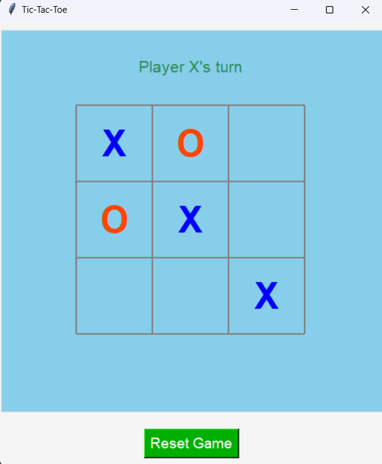

# Tic-Tac-Toe-Game

A simple and interactive Tic-Tac-Toe game built with Python's Tkinter library. Designed for two players, it features a responsive 3x3 grid, automatic winner/tie detection, and a reset button to restart the game 

<h2>Features:</h2>

- Switches turns between Player X and Player O.
- Detects and announces winners or ties.
- Modern design with vibrant colors and smooth gameplay. 

Enjoy a classic game with a polished interface! 🎮

